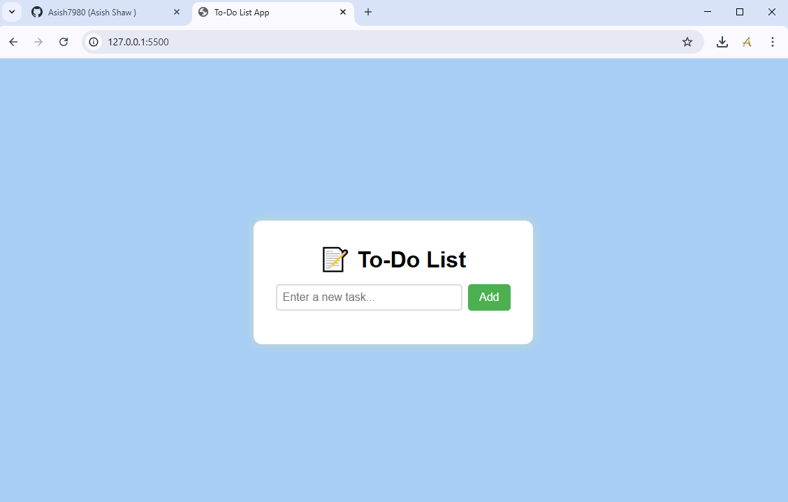
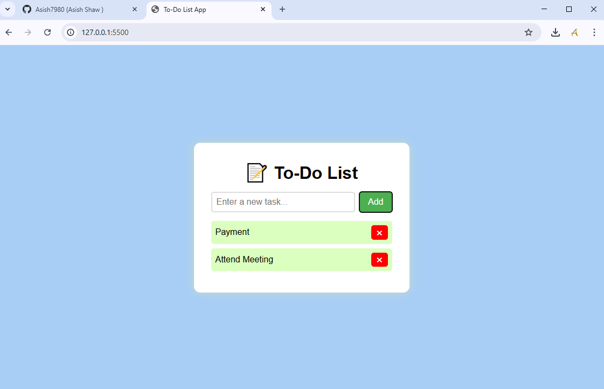

# 📝 To-do List Web Application

A simple, clean, and user-friendly web application that allows users to create, manage, and delete to-do items. Ideal for staying productive and organized in daily life.

## 📸 Screenshots

### Main Interface


### Added Task



## 🚀 Features

- ➕ Add new tasks
- ✅ Mark tasks as completed
- ❌ Delete tasks
- ⌨️ Add task using Enter key
- 📱 Responsive design for all screen sizes
- 💾 Optional: Easily extendable with `localStorage` or backend integration


## 🛠️ Tech Stack

- **Frontend:** HTML, CSS, JavaScript (Vanilla)
- **No Backend Required** (but extendable with Node.js, Express, MongoDB, etc.)


## 📂 Folder Structure
```
To-do-List/
│
├── index.html # Main HTML file
├── style.css # Styling for the application
├── script.js # App functionality using JavaScript
└── screenshots/ # Folder for screenshots (optional)
```

## 📦 How to Run Locally

1. Clone the repository:
   ```
   git clone https://github.com/Asish7980/To-do-List.git
   ```
Navigate to the project folder:
```
cd To-do-List
```
Open index.html in your browser.

## 📌 Future Improvements
Add task due dates
Store tasks in localStorage or database
Add user authentication
Dark mode toggle

## 🤝 Contributing
Contributions are welcome!
Feel free to fork this repository and submit a pull request.

## 📄 License
This project is licensed under the MIT License.

## ✍️ Author
Asish Shaw
